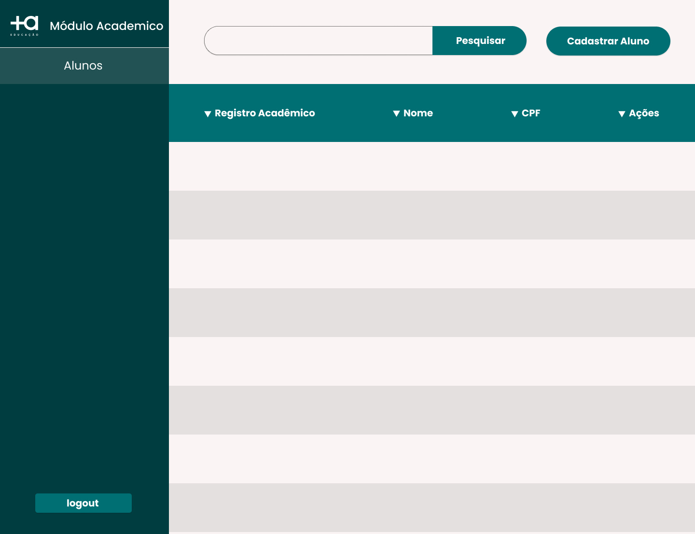

# Back-End

# Ferramentas

- [Visual Studio Community 2022](https://visualstudio.microsoft.com/pt-br/vs/community/) - IDE
- [Git/GitHub](https://github.com/) - Versionamento
- [Jira](https://www.atlassian.com/br) - Roteiro de desenvolvimento
- [Insomnia](https://insomnia.rest/download) - Testes de API
- [Beekeeper Studio](https://www.beekeeperstudio.io/) - Visualização dos dados no banco
- [Docker](https://www.docker.com/) - criação e gerenciamento de containers
- [OpenApi](https://www.openapis.org/) - documentação de recursos da API criada

# Arquitetura - RestFull

## Métodos

- GET - Retorno de um ou mais dados
- POST - Registro de um dado
- PUT - Atualização de um registro
- DELETE - Deleção de um registro

## Retorno de Status

- 200 - Recurso foi executado com sucesso
- 201 - Recurso foi criado com sucesso
- 203 - Recurso executado com sucesso mas não há retorno de conteúdo no body da requisição
- 404 - Recurso executado mas não foi encontrado um retorno

## Banco de dados

- Postgres - container docker

## Principais dependencias e pacotes utilizados

- AutoMapper - utilizado para fazer a converções de objetos
- FluentResults - para melhorar a verbosidade dos retornos de cada método da API
- AspNetCore.Identity, Identity.EntityFrameworkCore, EntityFrameworkCore, EntityFrameworkCore.Tools e EntityFrameworkCore.PostgreSQL foram utilizados para criar os contextos e métodos de persistência na camada de dados
- AspNetCore.Authentication, IdentityModel.Tokens.Jwt e Authentication.JwtBearer utilizado para criação dos tokens e performar a autenticação segurança da API

## Demonstração de resultados

---

# Front-End

## Ferramentas

- [Visual Studio Code](https://code.visualstudio.com/) - IDE
- [Figma](https://www.figma.com/) - Prototipação, design system e geração de assets

## Arquitetura

Realizada a divisão de responsabilidades na criação de componetes, paginas, camdada de conexão a API, camada de ações unificando os métodos criados para consumir e persistir os dados e camada de rotas publicas e privadas utilizando a autenticação fornecidad pelo backend sendo assim aprimorando a segurança da aplicação

## Tecnologias e Frameworks

- Vite - construtor utilizado para criar estrutura inicial do projeto, tal contrutor garante performance e leveza para a aplicação
- VueJs v3 - framework utilizado para a construção de uma single page application e componentização da plataforma.
- Vuetify 3.0.0 Beta - Utilizado como biblioteca de componetes diponível para VueJs
- Typescript - linguagem tipada tendo como base o javascript utilizada para todo o desenvolvimento do projeto frontend

## Principais dependencias e pactotes usados

- sass- Pré processador de css, facilitando o fluxo de aplicação de estilos
- vue-tostification - utilizado para notificação de ações de sucesso ou de erro ao usuário
- axios - utilizado para realizar todo processo de conexão, autenticação e consumo de recursos disponibilizados pela API construtor
- vue-router - utilizado para o gerenciamento de rotas e fluxo entre as paginas da aplicação
- maska - utilizado para colocar mascaras e garantir o formato do dados esperado
- jwt-decode - essencial para garantir o uso do token e fazer o processo de atuenticação para o fluxo de rotas e recursos consumidos
- vuex - padrão de gerenciamento de estado

---

## Prototipação

## Demonstração de resultados

---

## Melhorias

### Backend

- Adição de regras de usuário administrador e padrão
- Adicionar testes automatizados
- Melhorar a qualidade do JWT (adicionar regras)
- Publicação e integração contínua

### Frontend

- Separar páginas em mais componentes
- Adicionar testes em jest e cypress
- Melhoria em tipagem de resquest e response
- Adicionar pagina de cadastro de usuários
- Melhorar performance de logout, monitorando expiração do token
- Publicação e hospedagem
